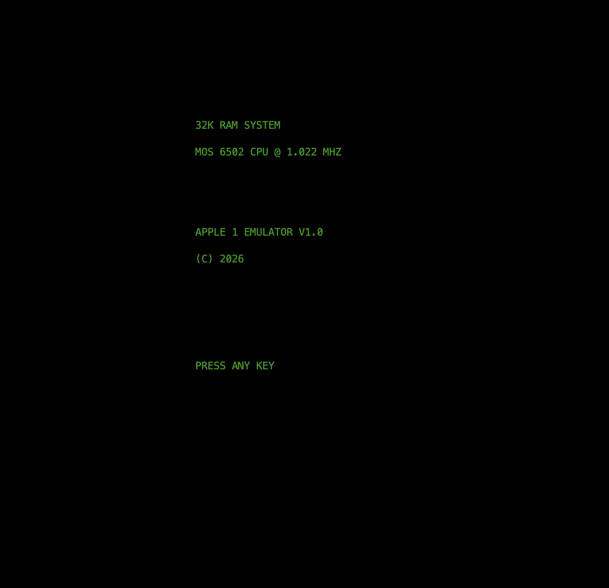
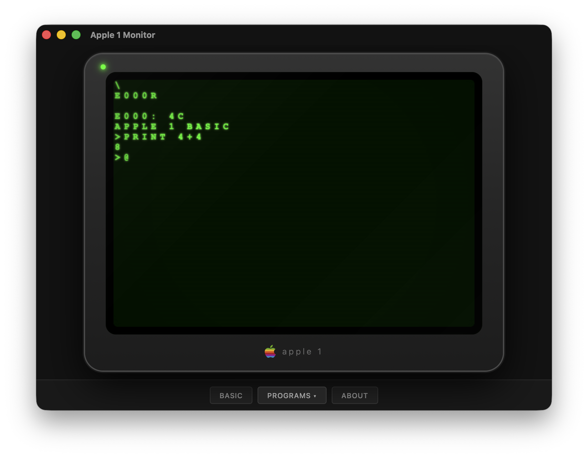
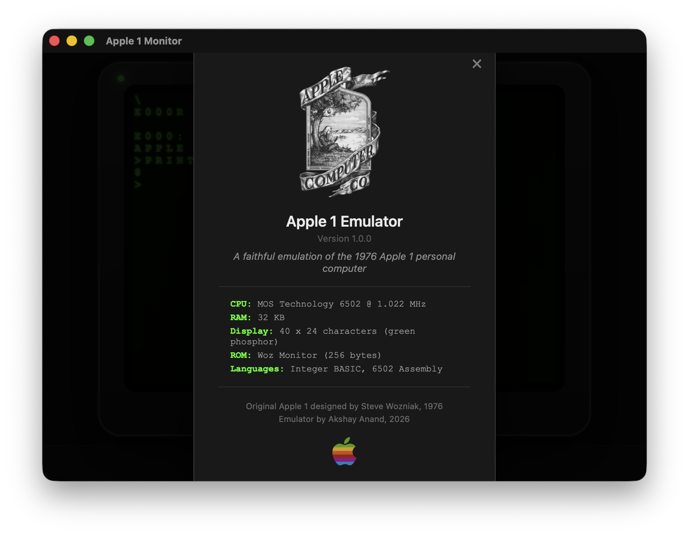

# Apple 1 Emulator

A faithful emulator of the 1976 Apple 1 computer — the first Apple product, designed by Steve Wozniak. Features the MOS 6502 CPU, original Woz Monitor ROM, Integer BASIC, and the iconic green phosphor glow of an Apple Monitor II.

Available as both a **terminal app** (ncurses) and a **native desktop app** (Tauri) with CRT shader effects.

   

## Screenshots







## Download (Desktop App)

**[Download Apple1Monitor.dmg](https://github.com/axayjha/apple1/releases/latest/download/Apple1Monitor.dmg)** (4 MB, macOS ARM64)

### Install

1. Download `Apple1Monitor.dmg`
2. Open the DMG and drag "Apple 1 Monitor" to your Applications folder (or run from anywhere)
3. On first launch, macOS will block it (unsigned app). Fix with:

```bash
xattr -cr "/path/to/Apple 1 Monitor"
```

Or if you placed it in Applications:

```bash
xattr -cr "/Applications/Apple 1 Monitor.app"
```

For the raw binary (no .app bundle):

```bash
xattr -cr ~/Downloads/Apple1Monitor.dmg
# then open the DMG and run the binary
chmod +x "Apple 1 Monitor"
xattr -d com.apple.quarantine "Apple 1 Monitor"
```

4. Double-click to run. You'll see the green phosphor CRT with the `\` Woz Monitor prompt.

## Features

### Authentic Hardware Emulation
- **MOS 6502 CPU** — All 151 official opcodes, BCD arithmetic, correct cycle timing, IRQ/NMI interrupts
- **Woz Monitor ROM** — The original 256-byte monitor program (verified binary from historical sources)
- **PIA 6820 I/O** — Faithful keyboard and display register emulation
- **Memory Map** — Configurable RAM (4KB/8KB/32KB/48KB) with proper ROM regions

### Programming Languages
- **Integer BASIC** — Full interpreter: arithmetic, strings, arrays, FOR/NEXT, GOSUB, IF/THEN, PEEK/POKE
- **6502 Mini-Assembler** — Write and assemble machine code interactively with labels and directives
- **C support** — Compatible with cc65 cross-compiler toolchain for 6502 C development

### Display & Experience
- **Apple Monitor II aesthetic** — Green phosphor text on black background
- **Phosphor glow effect** — Recently typed characters glow brighter, then fade
- **Blinking @ cursor** — Just like the original hardware
- **40/80 column modes** — Toggle between authentic and enhanced display
- **Startup branding screen** — Shows system info before dropping to monitor

### Storage & State
- **Virtual Cassette (ACI)** — Save/load programs to virtual tape files
- **Virtual Disk** — Sandboxed filesystem at `~/.apple1emu/disks/`
- **Machine Snapshots** — Save and restore complete emulator state instantly (Ctrl+S/Ctrl+L)
- **Configuration persistence** — Settings saved to INI file

### Developer Features
- **220 automated tests** — CPU opcodes, integration, BASIC interpreter, end-to-end
- **Structured logging** — 5 levels, 9 components, configurable output
- **Headless mode** — For scripting and automated testing
- **Zero external dependencies** — Only requires ncurses (system-provided on macOS)

## Getting Started

### Prerequisites

macOS with Xcode Command Line Tools:

```bash
xcode-select --install
```

### Build

```bash
git clone git@github.com:axayjha/apple1.git
cd apple1
make
```

This produces a single `apple1emu` binary (~150KB).

### Run

```bash
./apple1emu
```

You'll see a startup screen, then press any key to enter the **Woz Monitor** (prompt: `\`).

### Enter BASIC

At the `\` prompt, type:

```
E000R
```

You'll see `APPLE 1 BASIC` and a `>` prompt. Try:

```
PRINT "HELLO WORLD"
PRINT 6 * 7
```

### Write a Program

```
10 FOR I = 1 TO 10
20 PRINT I * I
30 NEXT I
RUN
```

### Use the Woz Monitor

The monitor lets you examine/modify memory directly:

| Command | Example | What it does |
|---------|---------|-------------|
| Examine | `FF00` | Show byte at address $FF00 |
| Range | `FF00.FF0F` | Show 16 bytes starting at $FF00 |
| Deposit | `0300:A9 42` | Write bytes at $0300 |
| Run | `0300R` | Execute code at $0300 |

### Enter Machine Code

At the `\` prompt, type this to write "HI" to the screen:

```
0300: A9 C8 20 EF FF A9 C9 20 EF FF 4C 1F FF
0300R
```

## Keyboard Controls

| Key | Action |
|-----|--------|
| Ctrl+Q | Quit emulator |
| Ctrl+R | Warm reset (back to `\` prompt) |
| Ctrl+F | Toggle fast mode (removes timing delays) |
| Ctrl+D | Toggle debug overlay (CPU registers) |
| Ctrl+E | Configuration menu |
| Ctrl+S | Save machine snapshot |
| Ctrl+L | Load machine snapshot |
| Ctrl+C | Break (stop running BASIC program) |

## Command-Line Options

```
./apple1emu [OPTIONS]

  --ram SIZE       RAM size: 4k, 8k, 32k, 48k (default: 32k)
  --fast           Disable timing delays
  --no-glow        Disable phosphor glow effect
  --no-scanlines   Disable scanline effect
  --log LEVEL      Log level: error, warn, info, debug, trace
  --headless       No display (for testing/scripting)
  --version        Show version
  --help           Show usage
```

## Included Demo Programs

15 BASIC programs in `demos/` — type them in at the `>` prompt:

| Program | Description |
|---------|-------------|
| `hello.bas` | Hello World |
| `fibonacci.bas` | First 20 Fibonacci numbers |
| `guess.bas` | Number guessing game (1-100) |
| `sieve.bas` | Sieve of Eratosthenes (primes to 100) |
| `adventure.bas` | 5-room text adventure |
| `lunarlander.bas` | Classic lunar landing game |
| `wumpus.bas` | Hunt the Wumpus (1972 classic) |
| `hamurabi.bas` | Manage a Sumerian city-state |
| `life.bas` | Conway's Game of Life |
| `startrek.bas` | Simplified Star Trek |
| `nim.bas` | Matchstick strategy game |
| `mastermind.bas` | Bulls and Cows code-breaking |
| `star.bas` | Diamond pattern generator |
| `sort.bas` | Bubble sort demonstration |
| `calendar.bas` | Monthly calendar printer |

## Testing

```bash
make test
```

Runs 220 automated tests:
- **148** CPU tests (all opcodes, BCD, flags, interrupts, page crossing)
- **10** integration tests (Woz Monitor commands via full stack)
- **22** BASIC interpreter tests (arithmetic, strings, control flow)
- **40** end-to-end tests (simulated user sessions)

## Project Structure

```
├── Makefile              Build system
├── README.md             This file
├── MANUAL.md             Complete user manual (3000+ lines)
├── src/
│   ├── cpu.c/h           6502 CPU emulation (function pointer dispatch)
│   ├── memory.c/h        64KB bus, ROM protection, I/O dispatch
│   ├── pia.c/h           Motorola 6820 PIA (keyboard + display)
│   ├── display.c/h       ncurses terminal rendering
│   ├── keyboard.c/h      Input handling and key mapping
│   ├── basic.c/h         Integer BASIC interpreter (~2500 lines)
│   ├── assembler.c/h     6502 mini-assembler
│   ├── snapshot.c/h      Machine state save/restore
│   ├── aci.c/h           Virtual cassette interface
│   ├── disk.c/h          Sandboxed virtual filesystem
│   ├── config.c/h        Configuration (INI persistence)
│   ├── log.c/h           Structured logging
│   ├── roms_builtin.c/h  Woz Monitor ROM data
│   └── main.c            Entry point and emulation loop
├── tests/                4 test programs (220 assertions)
└── demos/                15 BASIC programs
```

## Desktop App (Apple 1 Monitor)

The `apple1-monitor/` subfolder contains a native macOS desktop app built with Tauri (Rust + Web):

- CRT phosphor rendering with green glow, scanlines, and vignette
- Apple Monitor II bezel styling with rainbow Apple logo
- One-click program loading from the PROGRAMS menu
- BASIC button to instantly enter BASIC mode
- RESET button to return to Woz Monitor from any state
- About dialog with original Apple Computer Co. Newton logo

### Build from source

```bash
# Requires: Rust, Node.js
cd apple1-monitor/src-tauri
cargo build --release
./target/release/apple1-monitor
```

### Create DMG

```bash
make installer
# or manually:
./tools/create-installer.sh
```

## Documentation

See [MANUAL.md](MANUAL.md) for the complete user manual covering:
- Woz Monitor command reference
- BASIC programming guide with keyword reference
- Mini-assembler usage
- Virtual disk commands
- All demo program instructions
- 6502 instruction set reference
- Memory map

## About the Apple 1

The Apple 1 was the first product sold by Apple Computer, Inc. Designed by Steve Wozniak and hand-built in the Jobs family garage in 1976, only ~200 units were produced. It shipped as a bare PCB — buyers supplied their own keyboard, power supply, and display. The entire system ran on a 1 MHz MOS 6502 CPU with 4KB of RAM and Wozniak's brilliant 256-byte monitor program.

## License

Educational/hobby project. The Woz Monitor ROM was published in the Apple 1 Operation Manual (1976) and is freely available from historical preservation sources.
